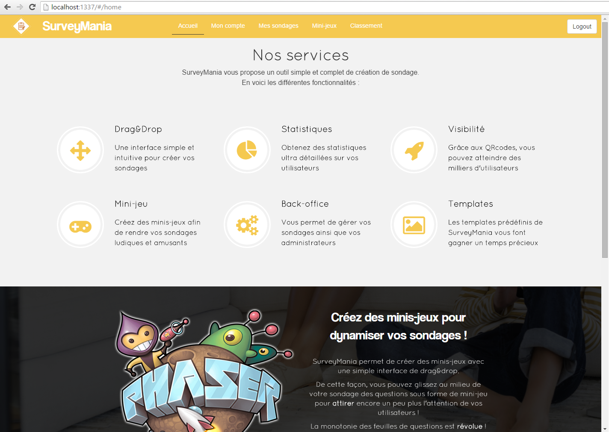

# SurveyMania

**SurveyMania**  `EPITA 2016 - MTI PLIC - bourdi_c / sabot_p / lopes_t`

**Team**  `Clément Bourdin (PM), Pierre Sabot, Tommy Lopes`  

> Survey Creation / AngularJS / Node.js / MongoDB / Group of 3

* Project management, Conception, Design, Programming
* Node.js, AngularJS, Bootstrap, PostgreSQL, MongoDB, Web technologies
* Group of 3

As part of the Free Project for Innovation and Communication at EPITA, I am part of a 3-member team working on this project. The task is to imagine, create and realize an innovative project in new technologies for web and mobile.

SurveyMania is a website destined to shops for creating online surveys by rewarding its users. After the creation of a survey by a shop, it is spread thanks to a QRcode that clients need to flash for accessing it. After what customers can answer the survey via their smartphone or computer to obtain points or discounts distributed by the shop.  
These discounts are created as bar codes that the customer will use on his next checkout.  
The application allows shop owner and administrators to access statistics regarding the habits of the users and their products, in order to improve their services.  
Customers also have the possibility to answer surveys throught mini-games to improve user satisfaction by introducing gamification.

## Install and run the application

1) Git, Node.js and npm installation

    $ sudo apt-get install git nodejs-legacy npm
    
2) Bower installation

    $ sudo npm install -g bower
    
3) PostGreSQL installation

    $ sudo apt-get install postgresql
  
4) Getting the projet

    $ git clone https://github.com/tommybl/SurveyMania.git
  
5) Going to project root

    $ cd SurveyMania
  
6) Server launching

    $ nodejs server.js
  
7) Open the application in a browser at http://localhost:1337/

